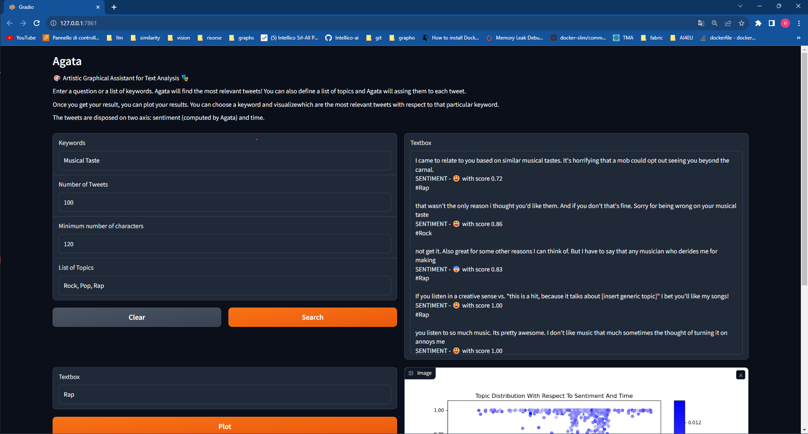

# AGATA
Artistic Graphical Assistant for Text Analysis (AGATA): unveil connections and communities among artists and their audience through **Explainable AI-Powered Similarity Search**. A platform to explain why contents from sources like social media are related, fostering trustworthy information

## What is AGATA?
We developed a community detection system to unveil trends and relations among information related to art (starting with social media). Communities, relevance, and potential hidden social bias are explored with Explainable AI+NLP, building a proximity graph among contents with similar meaning and visually showing/explaining similarities.

The tool enhances data analytics for artist communities; its engine can handle information from trustworthy and profiled sources (e.g. social media authorized APIs like Twitter, ..), performs searches by combination of keywords (e.g.: rock music and melancholy), and returns:
- **Rank of relevant multimedia contents**, marked by tags conveying meaning (art domain, stream, ..) in a list of topics and by a score of relevance
- **Sentiment analysis**, identifying nuances
- **Interactive visualization of results** in communities of contents to unveil trends/niches in audience with Explainable AI
- **Multimedia input**
- **Conversational interaction** in queries and reporting

## How does it work
Something about architecture, database, similarity engine, sentiment analysis engine, topic discovery engine.

## Try our demo!
Our demo allows you to query a database of 1 Million tweets. As you can see, you just need to add some keywords or a question, and a relevant list of tweets is returned. Every tweet has associated a sentiment and a topic from a topic list previously fed by the user. 
Then, the user can also select a topic and ask Agata to plot the data. The brighter a data point is, the higher the similarity with respect to the query is.



### Run the Demo
Install the dependencies of the repository. Dependencies are handled with conda. Refer to [this site](https://conda.io/projects/conda/en/latest/user-guide/install/index.html) to install conda.
```
conda env create -f environment.yml
```


If you want to run the demo, just
```
bash demo.sh
```
This command will download the dataset (roughly 3 GB of data) and launch the application. When the application is ready it will give you a link, just click. Otherwise, [click here](http://127.0.0.1:7860).

If you are interested in building the whole application, run the following commands:
```
wget https://archive.org/download/twitter_cikm_2010/twitter_cikm_2010.zip
unzip twitter_cikm_2010.zip -d data/Cheng-Caverlee-Lee
rm twitter_cikm_2010.zip
ploomber inject
ploomber build
python app.py
```
This will download a much smaller version of the dataset (~400 MB), but it will be preprocessed to get the final dataset.

### Demo Dataset
For the demo, we are using the [Cheng-Caverlee-Lee Tweets dataset](https://archive.org/details/twitter_cikm_2010), a collection of scraped public Twitter updates used in coordination with an academic project to study the geolocation data related to twittering. 

## License


This project is licensed under the MIT License. See the [LICENSE](LICENSE) file for details.